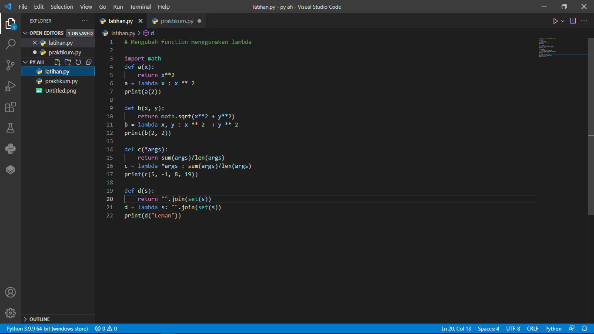
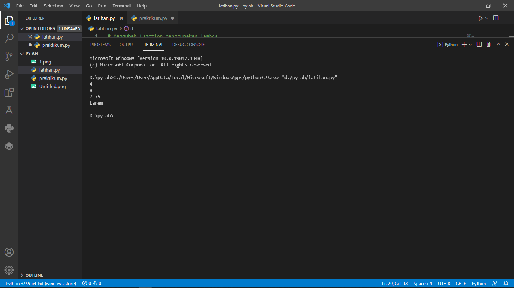
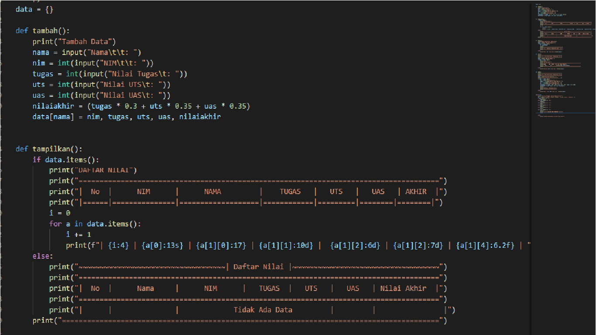
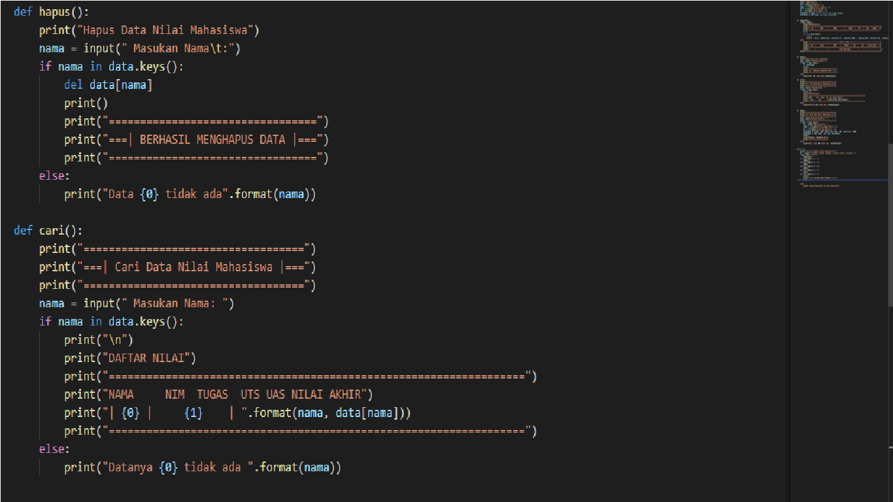
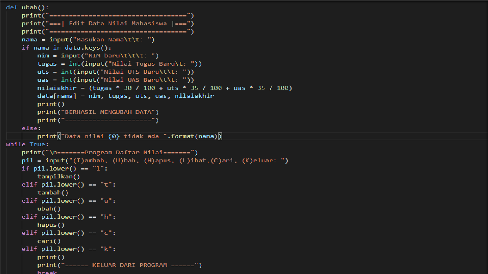
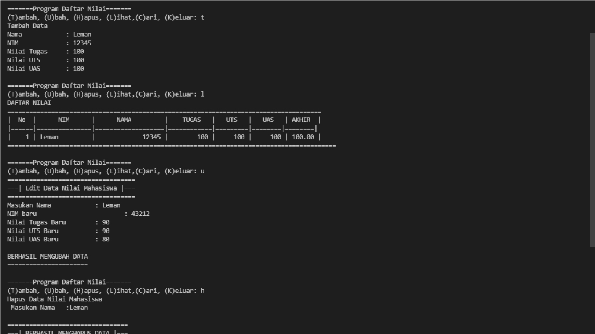
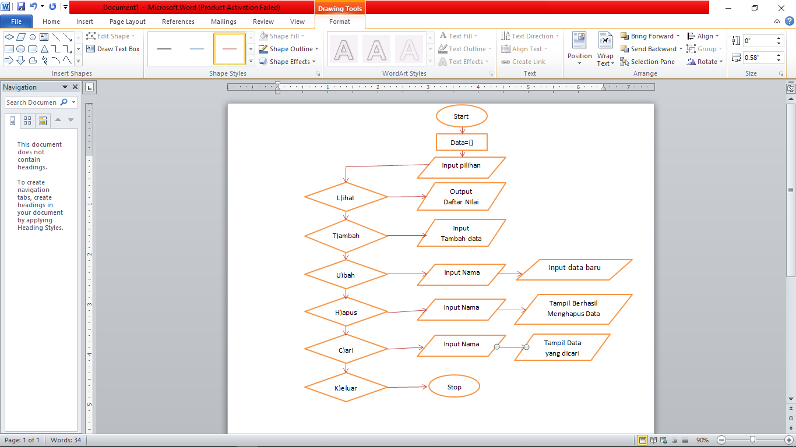

# praktikum6

## LATIHAN
mengubah function menggunakan lambda.
berikut adalah source code nya

Dan dibawah ini hasilnya
berikut adalah source code nya

# Praktikum
## membuat program input data mahasiswa (T)ambah, (U)bah, (H)apus, (L)ihat,(C)ari, (K)eluar:
berikut adalah programnya, perhatikan dengan teliti

Dan dibawah ini adalah hasil run program tersebut

#### Berikut ini adalah flowchart dan penjelasannya
 
#### Start
#### inputkan data={ } sesuai kenginan dengan format dictionary
#### Gunakan perulangan While True untuk menampilkan data sebanyak banyaknya
#### Masukan perintah g = input("(T)ambah, (U)bah, (H)apus, (L)ihat,(C)ari, (K)eluar: "),untuk mendapatkan perintah Tambah, Ubah, Hapus,Lihat,Cari,Keluar.
#### Menambahkan data menggunakan fungsi elif, lalu masukan nama, nim, tugas, uts, uas, nilaiakhir, nilai akhir didapat dari = ((tugas)*30/100+(uts)*35/100+(uas)*35/100)
#### Jika ingin memilih "lihat" gunakan fungsi 'elif' dan gunakan fungsi 'for x in data.items():' untuk memasukan data kedalam tabel data yang kita inputkan, dengan perintah "l". jika data yang tidak terdaftar = 0
#### Untuk menampilkan pilihan "hapus"gunakan fungsi 'elif' kemudian gunakan fungsi 'if nama in data.keys():' kemudian fungsi'del.data[nama] jika nama yang kita hapus tidak ada dalam tabel maka gunakan fungsi 'else' untuk menampilkan data tidak ada.
#### Lalu untuk menampilan pilihan "cari"" gunakan fungsi 'elif' kemudian gunakan fungsi if nama in data.keys():' untuk mencari data nama kemudian gunakan fungsi 'else' untuk menampilkan data nama yang kita cari tidak ada.
#### Lalu jika ingin keluar dari program gunakan fungsi 'if' kemudian gunakan fungsi break untuk keluar dari data nilai/menghentikan program
#### Stop